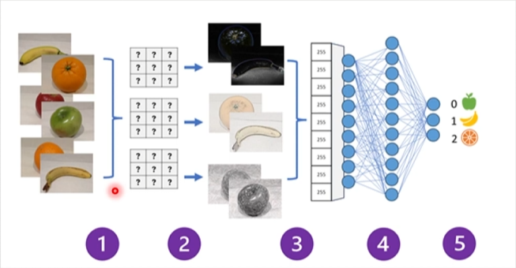

# Visão Computacional

## Conceitos de Visão Computacional

### Imagens e Processamento de Imagens

1. Organização de conteúdo
    - Exemplo: Análise de Documentos
2. Análise espacial
    - Exemplo: Análise de foto de uma cidade

### Redes Neurais Convolucionais

1. Imagens rotuladas são usadas no treinamento

2. Filtro extrai mapas de recursos de cada imagem

3. Mapas de recurso são reunidos

4. Valores dos recursos são alimentados em uma rede neural totalmente conectada

5. A camada de saída produz um valor de probabilidade para cada rótulo de classe

### Modelos multimodais

"Legenda"
> Modelo encapsula relações semânticas entre recursos extraídos

## Serviços de visão computacional no Azure

- Visão
    1. Análise de imagens
    2. Marcação de imagens, legendas, personalização de modelos, etc.
    3. Reconhecimento óptico de caracteres
    4. Análise espacial

- Face
    1. Detecção de Rosto
    2. Reconhecimento Facial

### Vision Service

- Personalização do modelo
- Ler texto de imagens
- Detecte pessoas em imagens
- Gerar legendas em imagens
- Detectar objetos
- marcar recursos visuais
- Corte inteligente

### Face Service 
 
- Desfoque
- Exposição (ruído)
- Correspondência de similaridade
- Verificação de identidade

### OCR

Detectar a localização do texto:
- Impresso
- Escrito à mão